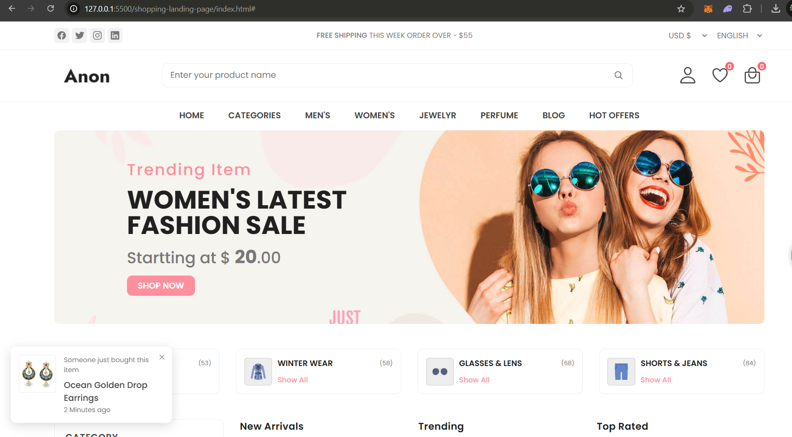

# E-commerce Landing Page

This project is a fully responsive e-commerce landing page built using HTML, CSS, and JavaScript. It is designed to highlight trending fashion items, categories, and user interactions for a seamless shopping experience.

## Features

- **Responsive Design**: Compatible with desktop and mobile devices.
- **Product Search**: Input field for searching products.
- **Categories and Offers**: Quick navigation for categories and special offers.
- **Live Purchase Notifications**: Displays real-time notifications of recently purchased products.
- **Modern UI**: Clean, stylish design with intuitive navigation.

## Technologies Used

- **HTML5**: For creating the structure of the landing page.
- **CSS3**: For styling, including responsive design and animations.
- **JavaScript**: For interactivity, such as live notifications and dynamic content.

## How to Use

1. Clone this repository:
   ```bash
   git clone https://github.com/sharmadishant04/shopping-landing-page.git
    ```

## Landing page
